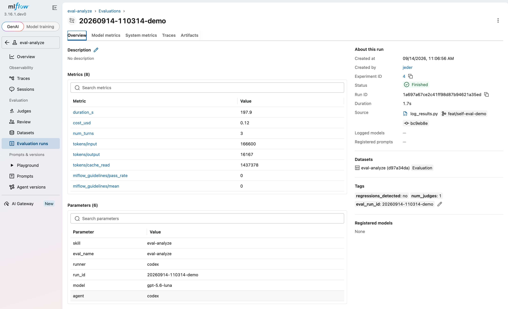
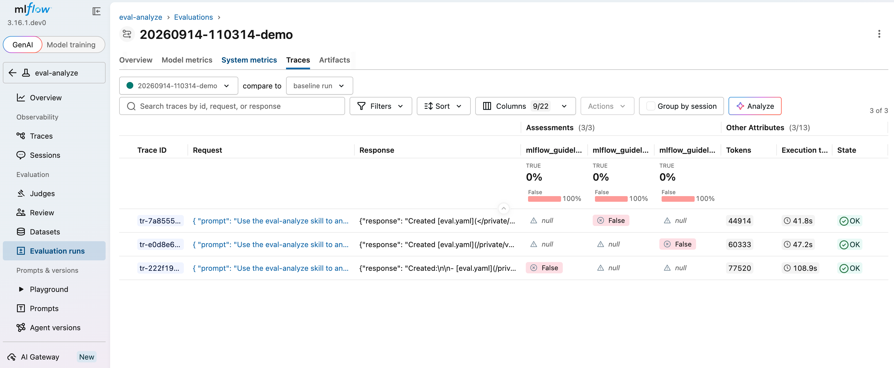
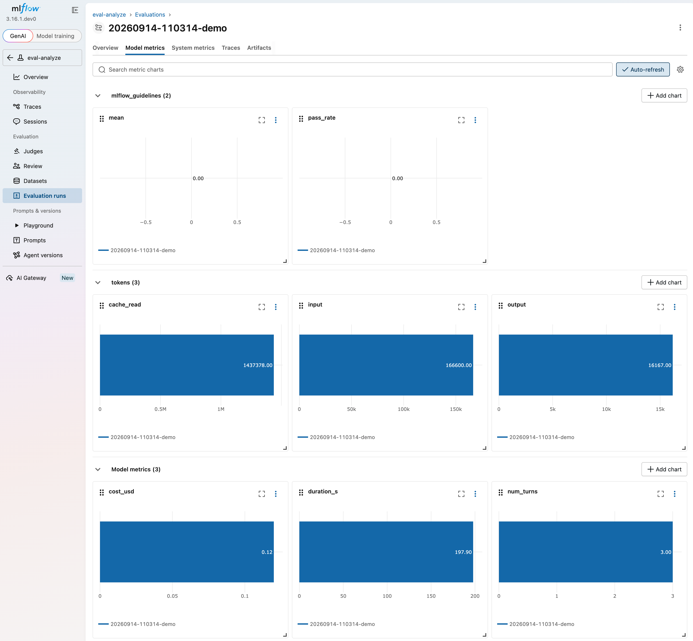

# MLflow-native evaluation backend

This directory documents the first demonstration of opt-in MLflow-native judge
support in `agent-eval-harness`. The demo self-evaluates the `eval-analyze`
skill, but self-evaluation is only the first consumer: the reusable feature is
the MLflow scorer path and evaluation-plane integration.

The suite uses the harness execution plane to run three source-backed cases
with the first-class `CodexRunner`, then uses MLflow as the evaluation plane
for the native `Guidelines` scorer, dataset, run, traces, and feedback.

## Why this branch exists

This is the first incremental step toward direct MLflow integration in the
harness. It does not replace the harness execution model, existing judge
defaults, or `BuiltinJudgeRegistry`. Instead, it adds an opt-in MLflow-native
judge path alongside them:

```yaml
judges:
  - name: mlflow_guidelines
    mlflow_scorer: Guidelines
```

An evaluation adopts MLflow judging only when it declares `mlflow_scorer`.
Existing evaluations continue using their current builtin, check, prompt, or
external judges. This makes MLflow adoption piecemeal: additional built-in
MLflow scorers and additional evaluation suites can be migrated when they are
ready, without a harness-wide migration.

The first slice also sends native datasets, runs, traces, and assessments to
MLflow. That makes the results review-ready in MLflow's UI and creates the
integration seam for MLflow Review Queues and future human-in-the-loop
workflows. The harness remains responsible for execution, workspace setup,
artifact collection, and orchestration.

## What this opens up

`Guidelines` is the first built-in MLflow judge used here. This opens a path
toward MLflow's broader judge catalog, adopted incrementally and explicitly,
for example:

- agent tool use: [`ToolCallCorrectness` and
  `ToolCallEfficiency`](https://mlflow.org/docs/latest/genai/eval-monitor/scorers/llm-judge/tool-call/);
- response quality and privacy: `Correctness`, `Completeness`, `Safety`, and
  `PIIDetection`;
- retrieval and RAG quality: [`RetrievalRelevance`,
  `RetrievalGroundedness`, and `RetrievalSufficiency`](https://mlflow.org/docs/latest/genai/eval-monitor/scorers/llm-judge/rag/);
- multi-turn quality: [`ConversationCompleteness`, `KnowledgeRetention`,
  and `UserFrustration`](https://mlflow.org/docs/latest/genai/eval-monitor/running-evaluation/multi-turn/).

See MLflow's [built-in judge catalog](https://mlflow.org/docs/latest/genai/eval-monitor/scorers/llm-judge/predefined/)
for the complete list and availability. These remain future, explicit
adoptions; this branch enables only `Guidelines` for the standard suite and
does not change any harness-wide defaults.

## Prerequisites

- Codex CLI credentials and access are available for the three
  `eval-analyze` invocations.
- MLflow 3.15 or later is running. The later human-review workflow uses
  MLflow's reviewer UI features; see the [MLflow review queues
  docs](https://mlflow.org/docs/latest/genai/assessments/review-queues/).

The evaluation uses MLflow's built-in [`Guidelines` LLM
judge](https://mlflow.org/docs/latest/genai/eval-monitor/scorers/). The
configured judge model is `gateway:/jeder-codex-endpoint`. Create that gateway
endpoint and its MLflow LLM Connection/API key in the MLflow UI; the [MLflow AI
Gateway quickstart](https://mlflow.org/docs/latest/genai/governance/ai-gateway/setup/)
and [supported judge model
docs](https://mlflow.org/docs/latest/genai/eval-monitor/scorers/llm-judge/custom-judges/supported-models)
describe that setup. The key is stored by MLflow rather than in this
repository.

Set the tracking server for the run with:

```bash
export MLFLOW_TRACKING_URI=http://127.0.0.1:5000
```

The Codex model under evaluation and the MLflow judge model are separate:
`models.skill` controls Codex execution, while the `Guidelines` entry in
`eval/eval-analyze/eval.yaml` controls the MLflow judge.

The standard suite does not modify `~/.codex/config.toml` or the user's global
Codex tracing configuration. It captures each Codex invocation's stream-JSON
events in the run workspace; `collect.py` preserves those events and
`log_results.py` creates one post-run MLflow trace per case.

## First demo: self-evaluate `eval-analyze`

The durable suite is configured in
[`eval/eval-analyze/eval.yaml`](../eval-analyze/eval.yaml). It contains three
curated, offline cases:

- `external-state`: analyzes the fake Jira skill and preserves its
  source-backed Jira dependency as `[EXTERNAL: Jira]`.
- `local-only`: analyzes `eval-setup` and its environment-check script without
  inventing an external system.
- `nested-skill`: analyzes `eval-optimize` together with its referenced
  `eval-run` skill without adding generic fixture or safety requirements.

The suite uses the MLflow built-in `Guidelines` scorer. Its guideline requires
the generated evaluation contract to be grounded in the files read for each
case and rejects invented fields, tools, outputs, judges, or generic policies.

## Run the suite

For the clean end-to-end demo, run the wrapper script:

```bash
./eval/self-eval/demo.sh
```

It creates a fresh run, executes the three Codex cases, scores them with
MLflow `Guidelines`, publishes the native MLflow evaluation run, attaches the
judge assessments, and prints only phase status plus the final MLflow URL.
Detailed command logs remain local and are shown only if a phase fails.

Captured output from the run shown below:

```text
[1/7] Checking MLflow server
      using MLflow server at http://127.0.0.1:5000 (version 3.16.1.dev0)
      status: complete
[2/7] Preparing evaluation workspace
      workspace: <temporary-workspace>
      status: complete
[3/7] Running three Codex cases
      cases: external-state, local-only, nested-skill
      external-state: OK
      local-only: OK
      nested-skill: OK
      status: complete
[4/7] Collecting generated eval.yaml files
      cases/external-state/eval.yaml/eval.yaml
      cases/local-only/eval.yaml/eval.yaml
      cases/nested-skill/eval.yaml/eval.yaml
      status: complete
[5/7] Scoring with MLflow Guidelines
      mlflow_guidelines: 0.0% pass (3 cases)
      status: complete
[6/7] Publishing the MLflow evaluation run
      run: 20260914-110314-demo
      status: complete
[7/7] Attaching judge assessments
      TRACES: 3 found
      FEEDBACK: 3 entries attached
      status: complete

Complete.
MLflow run: http://127.0.0.1:5000/#/experiments/4/runs/1a697a67ce2c41ff98d87b94621a35ed
```

The captured MLflow evaluation run:



The **Traces** view shows all three linked traces, populated request and
response previews, and the attached Guidelines assessments:



The **Model metrics** view shows the Guidelines aggregate metrics alongside
token usage, cost, duration, and turn count:



From the worktree:

```bash
export MLFLOW_TRACKING_URI=http://127.0.0.1:5000
RUN_ID="$(date +%Y%m%d-%H%M%S)-codex"
WORKSPACE=$(
  .venv/bin/python skills/eval-run/scripts/workspace.py \
  --config eval/eval-analyze/eval.yaml \
  --run-id "$RUN_ID" | awk '/^WORKSPACE: / {print $2}'
)
.venv/bin/python skills/eval-run/scripts/execute.py \
  --config eval/eval-analyze/eval.yaml \
  --workspace "$WORKSPACE" \
  --skill eval-analyze \
  --model gpt-5.6-luna \
  --agent codex \
  --mlflow-experiment eval-analyze \
  --output "eval/runs/eval-analyze/$RUN_ID" \
  --run-id "$RUN_ID"

.venv/bin/python skills/eval-run/scripts/collect.py \
  --config eval/eval-analyze/eval.yaml \
  --workspace "$WORKSPACE" \
  --output "eval/runs/eval-analyze/$RUN_ID"

.venv/bin/python skills/eval-run/scripts/score.py judges \
  --config eval/eval-analyze/eval.yaml \
  --run-id "$RUN_ID"
```

`workspace.py` materializes the case inputs and source files. `execute.py`
runs the three cases through `CodexRunner`. `collect.py` maps the generated
`eval.yaml` artifacts back to their cases. `score.py judges` applies the
configured MLflow `Guidelines` scorer and writes `summary.yaml` and the
per-case results under `eval/runs/eval-analyze/$RUN_ID`.

The standard suite's configured model is `gpt-5.6-luna` in
`eval/eval-analyze/eval.yaml`. The `--model` option above makes that choice
explicit; omit it to use `models.skill` from the config.

## Log the evaluation to MLflow

After scoring, create the native MLflow evaluation run, then attach judge
feedback to the corresponding traces:

```bash
.venv/bin/python skills/eval-mlflow/scripts/log_results.py \
  --config eval/eval-analyze/eval.yaml \
  --run-id "$RUN_ID"

.venv/bin/python skills/eval-mlflow/scripts/attach_feedback.py \
  --config eval/eval-analyze/eval.yaml \
  --run-id "$RUN_ID" \
  --source judge
```

`log_results.py` creates or reuses the native `eval-analyze` evaluation
dataset, logs the per-case results, links the three case traces to the
MLflow run, and records the generated artifacts. `attach_feedback.py` is the
single owner of trace assessments and pushes the `Guidelines` results onto
the matching MLflow traces. The MLflow UI is available at
`http://127.0.0.1:5000`.

The MLflow run's evaluation view shows the dataset, per-case results, trace
links, and the `Guidelines` feedback. The detailed Codex event trajectory is
available in each case's `events.json` and captured logs; the linked MLflow
trace contains the post-run case trace and attached assessments.

## Scope boundary

This is a small first integration slice. It does not replace existing judge
defaults or add a second evaluation framework. Harness scripts remain
responsible for workspace preparation, execution, artifact collection, and
result orchestration; MLflow provides the opt-in native scorer and evaluation
records. Additional evaluations can adopt the same path independently.
